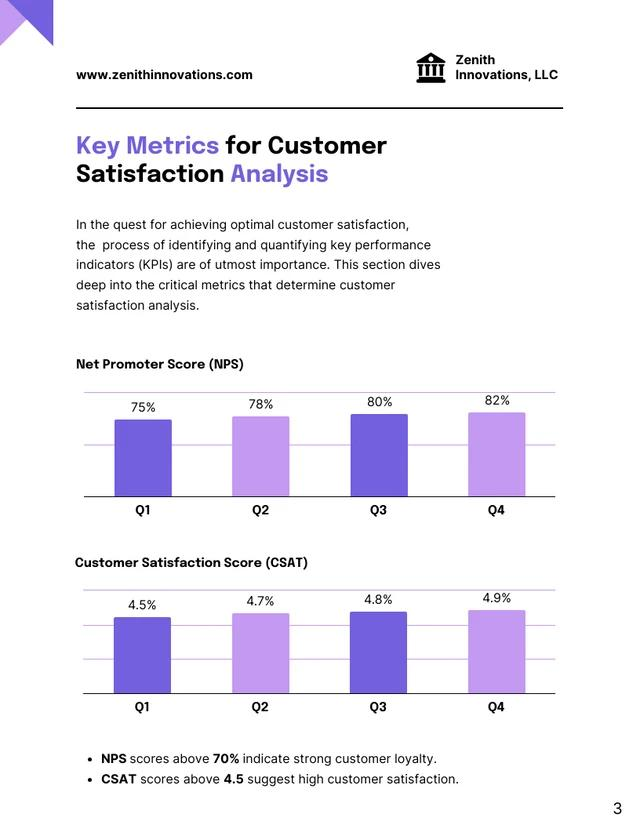
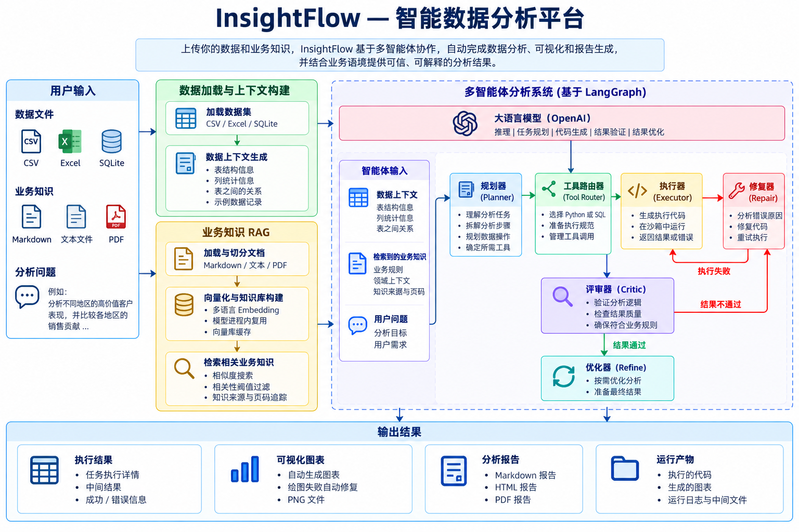
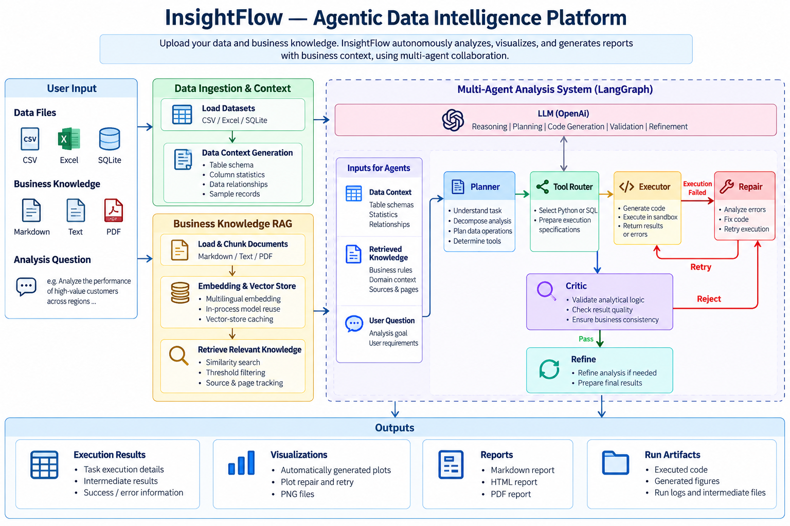

---
[English](#insightflow--agentic-data-intelligence-platform) | [中文](#insightflow--智能数据分析平台)


# InsightFlow — 智能数据分析平台
InsightFlow 是一个基于 LangGraph 和 LangChain 构建的 Agentic 数据分析平台。

用户可以上传结构化数据集以及可选的业务知识文档。InsightFlow 能够自动理解数据、规划分析任务、选择执行工具、生成并执行代码、修复执行错误、验证分析逻辑、生成可视化结果，并最终输出完整分析报告。

## 核心能力

- 支持 CSV、Excel 和 SQLite 多种数据源
- 自适应数据上下文生成
- 多表联合分析与推理
- Business Knowledge RAG
- 基于相似度的知识检索与相关性过滤
- 自动分析任务规划
- Python / SQL 动态工具路由
- 自动代码生成与执行
- 执行失败自动 Repair 与 Retry
- 基于 Critic Agent 的分析逻辑验证
- 分析结果自动 Refine
- 基于任务执行结果生成可视化
- 绘图失败自动修复与重试
- 自动生成 Markdown、HTML 和 PDF 报告
- 基于 FastAPI 的数据与知识文件上传接口
- 按 Run 保存分析产物与运行日志

## Demo 演示

### 自动生成的数据分析报告




## Agentic 工作流



```text
数据文件 + 业务知识
        |
        v
     数据加载
        |
        v
   自适应数据上下文
        |
        v
    业务知识 RAG
        |
        v
      Planner
        |
        v
 Python / SQL Router
        |
        v
      Executor
        |
        v
    Tool Execution
      /        \
    失败        成功
     |          |
     v          v
   Repair      Critic
     |        /      \
     |      不通过     通过
     |       |          |
     +----> Refine      |
              \         /
               v       v
               下一任务
                  |
                  v
          Visualization Planner
                  |
                  v
            Plot Generation
                  |
                  v
             Plot Execution
                  |
                  v
                Report
                  |
                  v
        Markdown / HTML / PDF
```

## 业务知识 Grounding

InsightFlow 支持使用 Markdown、TXT 和 PDF 等业务知识文档，为数据分析过程提供业务语义和规则约束。

例如，业务知识中可以定义：

> 高价值客户是指所有订单累计购买金额超过 400 美元的客户。

检索得到的业务规则不仅会提供给 Planner，还会贯穿：

```text
Planner
↓
Executor
↓
Repair
↓
Critic
↓
Refine
```

从而避免不同 Agent 在分析过程中自行修改已经明确的业务指标定义。

当前 Business Knowledge RAG 支持：

- 多语言 Embedding 检索
- 知识来源追踪
- PDF 页码追踪
- Similarity Score
- 相关性阈值过滤
- Embedding 模型进程内复用
- Vector Store 缓存

## 使用示例

输入：

```text
数据文件：
- customers.csv
- orders.csv

业务知识：
- business_rules.md

分析问题：
分析不同地区的高价值客户表现，
并比较各地区高价值客户的销售贡献。
```

InsightFlow 会自动完成：

1. 检索与当前问题相关的高价值客户业务定义；
2. 自动生成分析计划；
3. 汇总每位客户的累计购买金额；
4. 根据业务规则识别高价值客户；
5. 比较不同地区的销售表现；
6. 验证执行代码和分析结果是否符合业务规则；
7. 自动生成可视化图表；
8. 输出 Markdown、HTML 和 PDF 分析报告。

## 技术栈

- Python 3.11
- LangGraph
- LangChain
- OpenAI
- Pandas
- SQLite
- FastAPI
- Hugging Face Sentence Transformers
- Matplotlib
- Playwright


## 项目结构

```text
insightflow-agent/
├── agents/        # 各类分析 Agent
├── context/       # 自适应数据上下文
├── ingestion/     # CSV / Excel / SQLite 数据加载
├── knowledge/     # 示例业务知识
├── rag/           # Business Knowledge RAG
├── services/      # 分析服务层
├── tools/         # Python / SQL / Plot 工具
├── utils/         # 报告、重试等通用工具
├── docs/assets/   # README 架构图等资源
├── data/          # 示例数据
├── api.py         # FastAPI 入口
├── main.py        # CLI Demo 入口
├── nodes.py       # LangGraph 节点
├── state.py       # 工作流共享状态
└── workflow.py    # LangGraph 工作流定义
```

主要模块职责：

- `agents/`：负责分析规划、代码生成、错误修复、结果验证、结果优化和可视化规划
- `ingestion/`：负责加载 CSV、Excel 和 SQLite 数据
- `context/`：负责生成适合 Agent 使用的数据上下文
- `rag/`：负责业务知识文档加载、切分、Embedding、检索、相关性过滤和缓存
- `tools/`：负责 Python、SQL 和绘图代码的实际执行
- `services/`：封装完整分析流程，供 CLI 和 FastAPI 共同调用
- `nodes.py`：定义 LangGraph 工作流中的节点逻辑
- `workflow.py`：负责节点连接、条件路由和工作流构建
- `state.py`：定义各 Agent 共享的工作流状态
- `api.py`：提供 FastAPI 接口
- `main.py`：提供本地 Demo 启动入口## 项目结构

```text
insightflow-agent/
├── agents/        # 各类分析 Agent
├── context/       # 自适应数据上下文
├── ingestion/     # CSV / Excel / SQLite 数据加载
├── knowledge/     # 示例业务知识
├── rag/           # Business Knowledge RAG
├── services/      # 分析服务层
├── tools/         # Python / SQL / Plot 工具
├── utils/         # 报告、重试等通用工具
├── docs/assets/   # README 架构图等资源
├── data/          # 示例数据
├── api.py         # FastAPI 入口
├── main.py        # CLI Demo 入口
├── nodes.py       # LangGraph 节点
├── state.py       # 工作流共享状态
└── workflow.py    # LangGraph 工作流定义
```

主要模块职责：

- `agents/`：负责分析规划、代码生成、错误修复、结果验证、结果优化和可视化规划
- `ingestion/`：负责加载 CSV、Excel 和 SQLite 数据
- `context/`：负责生成适合 Agent 使用的数据上下文
- `rag/`：负责业务知识文档加载、切分、Embedding、检索、相关性过滤和缓存
- `tools/`：负责 Python、SQL 和绘图代码的实际执行
- `services/`：封装完整分析流程，供 CLI 和 FastAPI 共同调用
- `nodes.py`：定义 LangGraph 工作流中的节点逻辑
- `workflow.py`：负责节点连接、条件路由和工作流构建
- `state.py`：定义各 Agent 共享的工作流状态
- `api.py`：提供 FastAPI 接口
- `main.py`：提供本地 Demo 启动入口

## API 接口

InsightFlow 基于 FastAPI 提供健康检查、数据分析和报告下载接口。

### 健康检查

```http
GET /health
```

用于检查 API 服务是否正常运行。

示例返回：

```json
{
  "status": "ok"
}
```

### 上传数据并执行分析

```http
POST /analyze/upload
```

执行完整的 InsightFlow Agentic 数据分析流程。

表单参数：

- `files`：一个或多个 CSV、Excel 或 SQLite 数据文件
- `knowledge_files`：可选的 Markdown、TXT 或 PDF 业务知识文件
- `analysis_focus`：可选的自然语言分析目标

例如：

```text
files:
- customers.csv
- orders.csv

knowledge_files:
- business_rules.md

analysis_focus:
分析不同地区的高价值客户表现，
并比较各地区高价值客户的销售贡献。
```

接口返回内容可以包括：

- Run ID
- RAG 检索到的业务知识
- 知识来源、PDF 页码和相似度分数
- 分析计划
- 任务执行结果
- 最终失败任务
- 可视化计划与执行结果
- 最终分析报告
- 生成的图表和报告路径

### 下载分析报告

```http
GET /runs/{run_id}/report
```

用于下载指定分析任务生成的 PDF 报告。

例如：

```text
GET /runs/run_20261008_100352_0e920675/report
```

启动 FastAPI 后可以通过：

```text
http://127.0.0.1:8000/docs
```

打开 Swagger UI，直接测试所有接口。

## 当前限制

当前版本的 InsightFlow 主要面向本地开发、学习和项目演示场景。

目前主要限制包括：

- Vector Store 和缓存目前保存在进程内存中，服务重启后不会持久化。
- 分析请求目前采用同步执行方式，复杂任务需要等待完整工作流结束后才能返回。
- Python 执行虽然限制了部分内置能力，但还不是生产级安全沙箱。
- 上传文件和生成的分析产物目前保存在本地文件系统。
- 当前 API 暂未实现用户认证、权限控制和多用户隔离。
- RAG 检索阈值目前基于实验结果设定，还没有经过大规模 Benchmark 验证。

## 后续计划

未来可以进一步扩展：

- 安全的 Python Sandbox 执行环境
- 持久化向量数据库
- LangSmith 工作流追踪与可观测性
- RAG 与 Agent 分析质量 Benchmark
- 异步分析任务和后台执行
- 实时工作流进度推送
- 基于 DuckDB 的跨数据源分析
- 用户认证与多租户隔离
- 持久化 Artifact 与企业知识存储
- 可配置的 RAG 检索策略与 Reranking


## 安装

### 1. 克隆项目

```bash
git clone https://github.com/shauige66-hash/insightflow-agent.git
cd insightflow-agent
```

### 2. 创建 Python 虚拟环境

```bash
python -m venv .venv
```

Windows PowerShell：

```powershell
.\.venv\Scripts\Activate.ps1
```

### 3. 安装依赖

```bash
pip install -r requirements.txt
```

### 4. 配置环境变量

在项目根目录创建 `.env`：

```env
OPENAI_API_KEY=your_openai_api_key
```

也可以选择配置 Hugging Face Token：

```env
HF_TOKEN=your_huggingface_token
```

当前 Embedding 模型不强制要求 `HF_TOKEN`，但配置后可以避免 Hugging Face Hub 匿名请求的速率限制。

### 5. 安装 PDF 报告所需浏览器

InsightFlow 使用 Playwright 生成 PDF 报告：

```bash
playwright install chromium
```

如果本机已经安装 Google Chrome 或 Microsoft Edge，InsightFlow 也可能直接使用本地浏览器。

## 快速开始

### CLI 示例

运行：

```bash
python main.py
```

默认示例会分析：

```text
data/customers.csv
data/orders.csv
```

并使用业务知识：

```text
knowledge/business_rules.md
```

生成的分析产物会保存到：

```text
outputs/<run_id>/
```

包括：

```text
analysis_report.md
analysis_report.html
analysis_report.pdf
chart_*.png
```

### FastAPI

启动 API：

```bash
uvicorn api:app --reload
```

然后打开：

```text
http://127.0.0.1:8000/docs
```

可以直接上传：

- CSV、Excel 或 SQLite 数据文件
- Markdown、TXT 或 PDF 业务知识文档
- 自然语言分析问题

InsightFlow 会自动执行完整的 Agentic 数据分析流程，并返回分析结果与生成的报告产物。


# InsightFlow — Agentic Data Intelligence Platform

InsightFlow is an agentic data analysis platform built with LangGraph and LangChain.

Users can upload structured datasets and optional business knowledge documents. InsightFlow autonomously understands the data, plans analytical tasks, selects execution tools, generates and executes code, repairs failures, validates analytical results, creates visualizations, and produces final reports.

## Core Capabilities

- Multi-source data ingestion for CSV, Excel, and SQLite
- Adaptive data context generation
- Multi-table analytical reasoning
- Business Knowledge RAG
- Similarity-based knowledge retrieval and filtering
- Autonomous analysis planning
- Dynamic Python and SQL tool routing
- Code generation and execution
- Automatic execution repair and retry
- Critic-based analytical validation
- Automatic result refinement
- Result-grounded visualization generation
- Plot repair and retry
- Markdown, HTML, and PDF report generation
- FastAPI interface with dataset and knowledge-file upload
- Per-run artifacts and execution observability


## Demo & Results

### Automatically Generated Analysis Report


## Agentic Workflow



```text
Data Files + Business Knowledge
              |
              v
        Data Ingestion
              |
              v
       Adaptive Context
              |
              v
    Business Knowledge RAG
              |
              v
           Planner
              |
              v
      Python / SQL Router
              |
              v
          Executor
              |
              v
        Tool Execution
          /       \
       Error      Success
         |           |
         v           v
       Repair      Critic
         |        /      \
         |     Reject    Pass
         |       |         |
         +----> Refine     |
                   \       /
                    v     v
                  Next Task
                      |
                      v
          Visualization Planner
                      |
                      v
             Plot Generation
                      |
                      v
              Plot Execution
                      |
                      v
                   Report
                      |
                      v
         Markdown / HTML / PDF
```

## Business Knowledge Grounding

InsightFlow can use business documents such as Markdown, text, and PDF files to ground analytical decisions.

For example, a business rule may define:

> A high-value customer is a customer whose total purchase amount across all available orders exceeds $400.

The retrieved rule is propagated across planning, execution, validation, repair, and refinement so that agents do not silently redefine business metrics.

Knowledge retrieval includes:

- multilingual embedding retrieval
- source tracking
- PDF page tracking
- similarity scores
- relevance threshold filtering
- in-process embedding model reuse
- vector-store caching

## Example

Input:

```text
Data:
- customers.csv
- orders.csv

Business Knowledge:
- business_rules.md

Question:
Analyze the performance of high-value customers across regions
and compare their sales contribution.
```

InsightFlow automatically:

1. retrieves the relevant high-value customer definition,
2. plans the required analyses,
3. aggregates customer purchases,
4. identifies customers exceeding the business threshold,
5. compares regional performance,
6. validates the analytical logic,
7. generates visualizations,
8. produces Markdown, HTML, and PDF reports.

## Tech Stack

- Python 3.11
- LangGraph
- LangChain
- OpenAI
- Pandas
- SQLite
- FastAPI
- Hugging Face Sentence Transformers
- Matplotlib
- Playwright# InsightFlow — Agentic Data Intelligence Platform

InsightFlow is an agentic data analysis platform built with LangGraph and LangChain.

Users can upload structured datasets and optional business knowledge documents. InsightFlow autonomously understands the data, plans analytical tasks, selects execution tools, generates and executes code, repairs failures, validates analytical results, creates visualizations, and produces final reports.

## Installation

### 1. Clone the repository

```bash
git clone https://github.com/shauige66-hash/insightflow-agent.git
cd insightflow-agent
```

### 2. Create a virtual environment

```bash
python -m venv .venv
```

Windows PowerShell:

```powershell
.\.venv\Scripts\Activate.ps1
```

### 3. Install dependencies

```bash
pip install -r requirements.txt
```

### 4. Configure environment variables

Create a `.env` file in the project root:

```env
OPENAI_API_KEY=your_openai_api_key
```

An optional Hugging Face token can also be configured:

```env
HF_TOKEN=your_huggingface_token
```

`HF_TOKEN` is not required for the current embedding model, but it can avoid anonymous Hugging Face Hub rate limits.

### 5. Install browser support for PDF reports

InsightFlow uses Playwright to generate PDF reports.

```bash
playwright install chromium
```

If Google Chrome or Microsoft Edge is already available, InsightFlow may use the installed browser automatically.

## Quick Start

### CLI Demo

Run the built-in example:

```bash
python main.py
```

The default demo analyzes:

```text
data/customers.csv
data/orders.csv
```

with business knowledge from:

```text
knowledge/business_rules.md
```

Generated artifacts are stored under:

```text
outputs/<run_id>/
```

including:

```text
analysis_report.md
analysis_report.html
analysis_report.pdf
chart_*.png
```

### FastAPI

Start the API server:

```bash
uvicorn api:app --reload
```

Then open:

```text
http://127.0.0.1:8000/docs
```

The interactive API interface allows you to upload:

- CSV, Excel, or SQLite datasets
- Markdown, TXT, or PDF business knowledge documents
- a natural-language analysis question

InsightFlow then runs the complete agentic analysis workflow and returns the analysis results and generated artifacts.

## Project Structure

```text
insightflow-agent/
├── agents/
│   ├── planner.py
│   ├── executor.py
│   ├── critic.py
│   ├── repair.py
│   ├── refine.py
│   ├── visualizer.py
│   └── plot_repair.py
│
├── context/
│   └── context_builder.py
│
├── ingestion/
│   ├── loader.py
│   └── models.py
│
├── knowledge/
│   └── business_rules.md
│
├── rag/
│   ├── cache_key.py
│   ├── chunker.py
│   ├── config.py
│   ├── document_loader.py
│   ├── knowledge_service.py
│   ├── retriever.py
│   └── vector_store.py
│
├── services/
│   └── analysis_service.py
│
├── tools/
│   ├── python_tool.py
│   ├── sql_tool.py
│   └── plot_tool.py
│
├── utils/
│   ├── artifacts.py
│   ├── llm_retry.py
│   └── ...
│
├── docs/
│   └── assets/
│       ├── insightflow-architecture.png
│       └── insightflow-architecture-zh.png
│
├── data/
│   ├── customers.csv
│   └── orders.csv
│
├── api.py
├── main.py
├── nodes.py
├── state.py
├── workflow.py
├── requirements.txt
└── README.md
```

Key modules:

- `agents/` — planning, execution, repair, validation, refinement, and visualization agents
- `ingestion/` — CSV, Excel, and SQLite data loading
- `context/` — adaptive dataset context generation
- `rag/` — business knowledge loading, chunking, embedding, retrieval, filtering, and caching
- `tools/` — Python, SQL, and plotting execution tools
- `services/` — reusable analysis service used by CLI and API entry points
- `nodes.py` — LangGraph node implementations
- `workflow.py` — LangGraph workflow construction and routing
- `state.py` — shared workflow state definitions
- `api.py` — FastAPI interface
- `main.py` — local CLI demo entry point

## API Endpoints

InsightFlow exposes a FastAPI interface for health checks, analysis requests, and report retrieval.

### Health Check

```http
GET /health
```

Checks whether the API service is running.

Example response:

```json
{
  "status": "ok"
}
```

### Analyze Uploaded Data

```http
POST /analyze/upload
```

Runs the complete InsightFlow analysis workflow.

Form fields:

- `files` — one or more CSV, Excel, or SQLite data files
- `knowledge_files` — optional Markdown, TXT, or PDF business knowledge files
- `analysis_focus` — optional natural-language description of the analysis goal

Example:

```text
files:
- customers.csv
- orders.csv

knowledge_files:
- business_rules.md

analysis_focus:
Analyze the performance of high-value customers across regions
and compare their sales contribution.
```

The response can include:

- run ID
- retrieved business knowledge
- knowledge source, page, and similarity score
- analysis plan
- execution results
- failed tasks
- visualization plan and results
- final report content
- generated artifact paths

### Download Report

```http
GET /runs/{run_id}/report
```

Downloads the generated PDF report for a completed analysis run.

Example:

```text
GET /runs/run_20261008_100352_0e920675/report
```

Interactive API documentation is available at:

```text
http://127.0.0.1:8000/docs
```


## Limitations

The current version of InsightFlow is designed as a local development and demonstration platform.

Current limitations include:

- Vector stores and caches are maintained in process memory and are not persisted across service restarts.
- Analysis requests are executed synchronously, so long-running workflows block the request until completion.
- Python execution uses restricted built-ins but is not a production-grade security sandbox.
- Uploaded files and generated artifacts are stored on the local filesystem.
- The current API does not include authentication, authorization, or multi-user isolation.
- Retrieval thresholds are currently based on empirical testing rather than a large-scale retrieval benchmark.

## Future Work

Planned improvements include:

- secure sandboxed Python execution
- persistent vector database support
- LangSmith tracing and workflow observability
- retrieval and agent-quality benchmarks
- asynchronous analysis jobs and background execution
- real-time workflow progress streaming
- cross-source analytical querying with DuckDB
- authentication and multi-user isolation
- persistent artifact and knowledge storage
- configurable RAG retrieval strategies and reranking