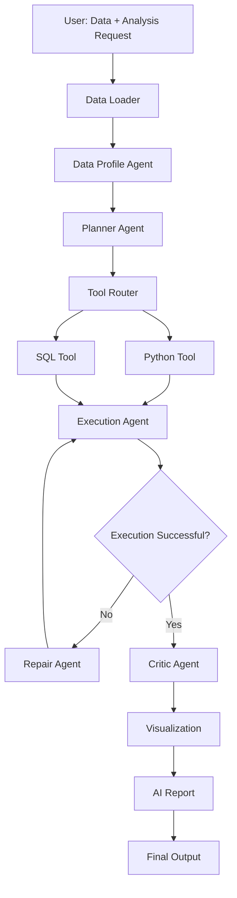

# InsightFlow Architecture

                  用户
                   │
                   │ 上传数据 + 提出分析需求
                   ▼
        ┌──────────────────────┐
        │     main.py          │
        │     程序入口          │
        └──────────┬───────────┘
                   │
                   ▼
        ┌──────────────────────┐
        │    Data Loader       │
        │ CSV / Excel / SQLite │
        └──────────┬───────────┘
                   │
                   ▼
        ┌──────────────────────┐
        │  Data Profile Agent  │
        │                      │
        │ 看数据结构            │
        │ 列名 / 类型 / 缺失值   │
        │ 行数 / 基础统计        │
        └──────────┬───────────┘
                   │
                   ▼
        ┌──────────────────────┐
        │    Planner Agent     │
        │                      │
        │ 理解用户问题          │
        │ 制定分析计划          │
        └──────────┬───────────┘
                   │
                   ▼
        ┌──────────────────────┐
        │     Tool Router      │
        │                      │
        │ 这个任务该用什么工具？ │
        └─────────┬────────────┘
                  │
           ┌──────┴───────┐
           ▼              ▼
  ┌────────────────┐ ┌────────────────┐
  │  Python Tool   │ │    SQL Tool    │
  │ pandas / numpy │ │ SQLite queries │
  └───────┬────────┘ └───────┬────────┘
          │                  │
          └────────┬─────────┘
                   ▼
        ┌──────────────────────┐
        │   Execution Agent    │
        │                      │
        │ 执行生成的代码 / SQL   │
        └──────────┬───────────┘
                   │
                   ▼
              执行成功吗？
               /      \
             NO        YES
             │          │
             ▼          ▼
   ┌────────────────┐  ┌────────────────┐
   │  Repair Agent  │  │  Critic Agent  │
   │                │  │                │
   │ 分析错误        │  │ 检查结果是否合理 │
   │ 修复代码        │  │ 有没有答到问题   │
   └───────┬────────┘  └───────┬────────┘
           │                    │
           │ retry              │
           └──────→ Execution   │
                                ▼
                    ┌────────────────────┐
                    │   Visualization    │
                    │                    │
                    │ 根据结果生成图表     │
                    └──────────┬─────────┘
                               │
                               ▼
                    ┌────────────────────┐
                    │    AI Report       │
                    │                    │
                    │ 分析结论 + 图表      │
                    │ 生成最终报告         │
                    └────────────────────┘